# Reclaim — Pay with proof.

**Reclaim** is a protected-payment platform on Celo. A client's payment is held in
on-chain escrow with clear terms; the worker delivers work and submits evidence;
a **Resolution Agent** autonomously prepares the case for **fair human review**;
and the contract settles — release to the worker or refund to the client —
with a durable, verifiable final receipt.

> Submission: **Celo Agentic Payments & DeFAI Hackathon — Track 2 (Most x402 Payments)**
> Live demo: https://reclaim-kaelah-s-projects.vercel.app
> Repo: https://github.com/kaelah971/Reclaim

---

## Problem

Freelance and service payments fail on trust. Paying first risks never receiving
the work; holding funds creates opaque, unaccountable disputes. When something
goes wrong there is no neutral path: evidence is scattered, no one prepares the
case, and the person deciding has nothing reliable to read.

## Solution

Reclaim turns a payment into a **case with proof**:

1. The client creates a payment with locked terms and funds it into an on-chain escrow.
2. The worker delivers and submits evidence tied to an on-chain evidence reference.
3. The **Resolution Agent** reads the agreement and escrow state, examines the
   evidence, pays a real x402 service to quality-check the evidence, and prepares
   a durable, neutral **review packet** for a human.
4. A person reviews and decides. The contract executes: release or refund.
5. Both sides get a **final receipt** composed only from verified sources —
   no fabricated fields.

## The Resolution Agent

> Objective: **"Prepare this payment case for fair human review."**

> Principle: **The contract protects the payment. The agent prepares the resolution. People make the final decision.**

The agent runs per-case with a dedicated case wallet:

- **Observes** the on-chain escrow state and the verified evidence metadata.
- **Plans** the next action and **executes** paid tools within budget.
- **Pays** for services through the official Celo x402 facilitator (real,
  on-chain settlement — see below).
- **Prepares** a durable review packet: evidence inventory, quality-check
  result, reviewer questions, ambiguities, and recommended improvements.
- **Stops before judgment.** The agent never releases, refunds, or votes.

## Protected payment lifecycle

```
Terms → Funds in escrow → Accepted → Delivery + evidence → Release requested
→ Agent-prepared human review → Released / Refunded → Final receipt
```

- Funds never leave the escrow contract except by release (to the worker) or
  refund (to the client), decided by a human.
- Evidence is committed on-chain (hash) and stored durably off-chain.
- The review packet is durable and includes the quality-check result plus any
  recorded inconsistencies — nothing is hidden from the reviewer.

## Celo integration

Reclaim integrates Celo in two clearly separated layers:

| Layer | Network | Purpose |
|-------|---------|---------|
| **Escrow** (`ProtectedPaymentEscrow`) | **Celo Sepolia** (testnet, `eip155:11142220`) | Product demo: protects the payment, records evidence references, executes release/refund |
| **x402 paid services** | **Celo Mainnet** (`eip155:42220`) | Real payments: the agent pays the official Celo facilitator, which settles USDC on-chain |

- **Escrow token:** USDC on Celo Sepolia (`0x01C5C0122039549AD1493B8220cABEdD739BC44E`).
- **x402 token:** USDC on Celo Mainnet (`0xcebA9300f2b948710d2653dD7B07f33A8B32118C`).
- **Registered Track 2 payTo / agent wallet:** `0x85522bdE267d05bf8CE8813F97c75417b7894A33`.
- **Attribution tag:** `celo_b7de8bf7e64e`.

### Celo Sepolia escrow vs Celo Mainnet x402 — the distinction

The demo escrow lives on the **testnet** so the full product flow (create →
fund → evidence → review → release → receipt) can be exercised safely. The
x402 settlements happen on **mainnet** because Track 2 counts real on-chain
x402 payments during the hackathon window. The escrow and the x402 fee are
deliberately separate: escrow holds the protected payment; x402 micro-fees pay
for agent services.

## Official Celo facilitator usage

The agent's paid tool (`evidence-quality-check`) is settled through the official
Celo x402 facilitator:

- **API:** `https://api.x402.celo.org` (production client URL; also known as `https://x402.celo.org`)
- **Protocol:** x402 v2, scheme `exact`, EIP-3009 `TransferWithAuthorization` signed by the agent's case wallet.
- **Flow:** `/verify` first, then `/settle` — settlement is accepted **only** with the facilitator's on-chain settlement proof (`txHash` + `settlementSuccess`). A successful HTTP call alone is never treated as proof.
- **Failure behavior:** no silent fallback to local settlement; a facilitator failure fails safely and becomes visible.

## Real Payment #1 — end-to-end proof (live demo case)

The live demo is a **completed, real, on-chain case** — not a simulation:

| Item | Value |
|------|-------|
| Escrow contract (V2, canonical) | `0x1A1CA38D6ac538d491A5c0db2Ed7FDDC3AeC709F` on Celo Sepolia |
| Payment #1 final state | `released` (state 5), 0.01 USDC (`10000` atomic) |
| Client | `0x76D7a718CcDc1c132c52D4C05eA0c2FA8e657486` |
| Worker (payTo wallet) | `0x85522bdE267d05bf8CE8813F97c75417b7894A33` |
| Evidence reference (on-chain) | `0x1bb11c9d819f4a69fc88c2eccb8fcf4343f07d965b1c87f7e3d3d7e5f94abb99` |
| Evidence submission tx | [`0xaee6b1de391c39daab71015c8d3d4326ec4b40ff577deca0c7471b9f2b677958`](https://celo-sepolia.blockscout.com/tx/0xaee6b1de391c39daab71015c8d3d4326ec4b40ff577deca0c7471b9f2b677958) |
| Release tx (human approved) | [`0x271d62cd50a1f9d1d2d1495f74be568050cf5a55e98690940840b2d5ec687298`](https://celo-sepolia.blockscout.com/tx/0x271d62cd50a1f9d1d2d1495f74be568050cf5a55e98690940840b2d5ec687298) |
| Released at | 2026-08-09T11:49:09Z |

All on-chain reads are read-only; the escrow state is verified directly via `getPayment(1)`.

## Real x402 settlement proof

The agent's evidence-quality-check was settled on **Celo Mainnet** through the
official facilitator:

| Item | Value |
|------|-------|
| Settlement tx | [`0x5f28527fff51fbb8961f6651b1646e3abcb829a4925dcdccf21d948d86dae351`](https://celoscan.io/tx/0x5f28527fff51fbb8961f6651b1646e3abcb829a4925dcdccf21d948d86dae351) |
| Status | `success` (block 74360582, 2026-08-09T07:42:20Z) |
| Amount | 0.01 USDC (10000 atomic) |
| Payer | agent case wallet `0x22bf4271a3f8f3c6885c0d2c825f06f9c9d7f72a` |
| PayTo | `0x85522bdE267d05bf8CE8813F97c75417b7894A33` |
| Broadcast by | official facilitator signer `0x0d74D5Cefd2e7F24E623330ebE3d8D4cB45fFB48` (EIP-3009 `transferWithAuthorization` on USDC `0xcebA9300f2b948710d2653dD7B07f33A8B32118C`) |

## Final receipt

`GET /api/payments/1/receipt` (public, read-only) composes the receipt from
verified sources only: live escrow state, on-chain release/evidence proofs,
verified evidence metadata, and the agent's durable review packet. It covers
the protected payment, the agreement, the evidence, the resolution agent, the
paid quality check (including recorded inconsistencies), the human decision,
and explorer audit links for every transaction.

Live receipt: https://reclaim-kaelah-s-projects.vercel.app/receipts/1

## Architecture

```mermaid
flowchart LR
    subgraph SEPOLIA["TESTNET — Celo Sepolia (product demo)"]
        C[Client] -->|creates payment, funds USDC escrow| E[ProtectedPaymentEscrow<br/>0x1A1CA38D...]
        W[Worker] -->|delivers work + submits evidence| E
        E -->|escrow state, evidence reference| R[Resolution Agent<br/>per-case wallet<br/>objective: prepare case for fair human review]
    end

    subgraph MAINNET["MAINNET — Celo (real x402 payments)"]
        R -->|pays $0.01 USDC x402| S[Evidence-quality service<br/>evidence-quality-check]
        S -->|x402 v2 /verify + /settle| F[Official Celo x402 facilitator<br/>api.x402.celo.org]
        F -->|EIP-3009 settlement| M[USDC settles to payTo<br/>0x85522bdE...]
        M -->|quality result + settlement proof| P[Review packet inputs]
    end

    P --> K[Durable review packet<br/>evidence, QC, reviewer questions, inconsistencies]
    K --> H[Human review]
    H -->|approve| REL[Release on escrow]
    H -->|dispute| RES[Human resolution / refund]
    REL --> REC[Final receipt]
    RES --> REC
```



**Testnet escrow and mainnet x402 are clearly separated**: escrow protects the
payment and settles by human decision on Celo Sepolia; x402 micro-payments for
agent services settle for real on Celo Mainnet through the official facilitator.

## Live demo

- Homepage: https://reclaim-kaelah-s-projects.vercel.app
- Payment #1 room (released): https://reclaim-kaelah-s-projects.vercel.app/payments/1
- Agent Control Room: https://reclaim-kaelah-s-projects.vercel.app/payments/1/agent
- Human review page: https://reclaim-kaelah-s-projects.vercel.app/payments/1/review
- Final receipt: https://reclaim-kaelah-s-projects.vercel.app/receipts/1

## Repository & deployment

- GitHub: https://github.com/kaelah971/Reclaim (public)
- Vercel project: `reclaim` → https://reclaim-kaelah-s-projects.vercel.app
- Stack: Next.js 16 (App Router), TypeScript (strict), Tailwind CSS v4, wagmi + viem, Supabase (durable evidence + agent store), Foundry (escrow contract)

### Local development

```bash
npm install
cp .env.example .env.local   # configure per instructions in the file
npm run dev
```

| Command | Description |
|---------|-------------|
| `npm run dev` | Start dev server (port 3000) |
| `npm run build` | Production build |
| `npm run lint` | ESLint |
| `npm run typecheck` | TypeScript type-check |
| `npm run test` | Unit tests (vitest) |

The escrow network is fixed in code to **Celo Sepolia** (chain ID `11142220`).
`X402_SETTLEMENT_MODE=celo-facilitator` routes agent payments through the
official Celo mainnet facilitator (Track 2 mode); `local` is development-only
testnet settlement.

## Track 2 — Most x402 Payments

Reclaim targets **Track 2** (`most-x402-payments`) by:

- routing every agent-paid service through the **official Celo x402 facilitator** on **Celo Mainnet**;
- settling **0.01 USDC** per evidence-quality-check (`evidence-quality-check` tool, price `10000` atomic);
- using the **registered payTo wallet** `0x85522bdE267d05bf8CE8813F97c75417b7894A33` for all settlements (enforced in code and tests);
- proving each settlement on-chain (`settlement_tx_hash`) and persisting it durably in the review packet and receipt.

Real on-chain settlement this window: `0x5f28527fff...dae351` (0.01 USDC, mainnet, 2026-08-09).

Leaderboard: https://dune.com/celo/agentic-payments-defai-hackathon

## What is intentionally unimplemented

- Reviewer rewards / reputation (planned after launch; reviews are free today).
- A paid dispute-brief tool in production (the agent's production path settles only `evidence-quality-check`; dispute-brief settlement is not wired).
- WalletConnect connector (optional; requires a project ID).
- Mutual security bonds (future scope, explicitly not in the MVP).

## Notes on proof discipline

- All on-chain proofs in this README were verified read-only against the live networks (Celo Sepolia and Celo Mainnet).
- The receipt API never fabricates fields — missing sources produce `null`.
- No secrets, keys, or API keys are referenced in this repository's documentation.
